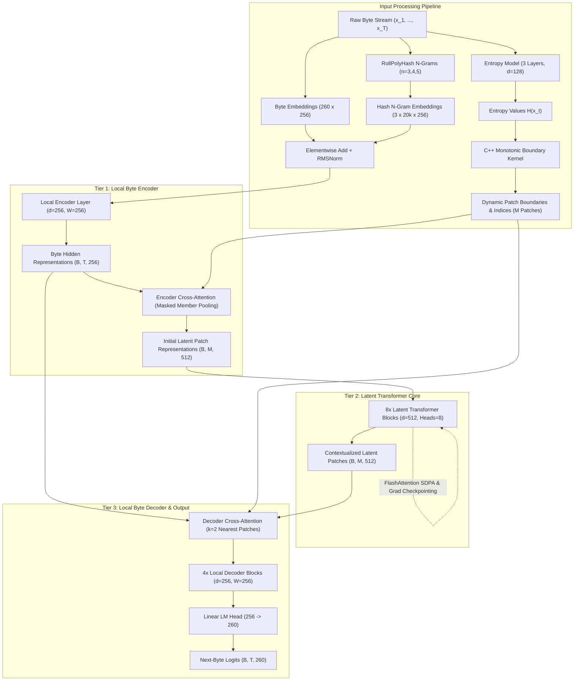
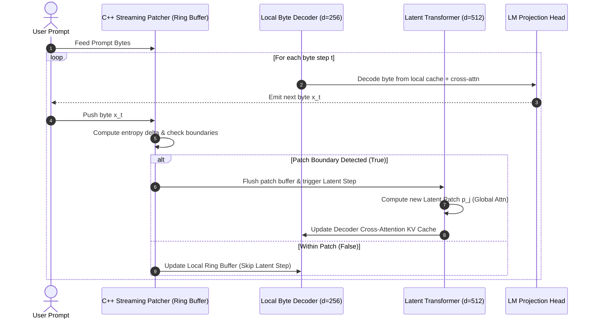

# Byte Latent Transformer (BLT) — System Architecture Specification

**Model Architecture:** Byte Latent Transformer (~46.3M Parameters)  
**Target Hardware:** Consumer GPU (NVIDIA GeForce RTX 3050 Laptop GPU, 4 GB VRAM)  
**Native Engine:** `BLT-Native-0.1.0` (C++20 Triad: DLL / Static Archive / Standalone CLI)  
**Paper Reference:** *"Byte Latent Transformer: Patches Scale Better Than Tokens"* (*Pagnoni et al., Meta FAIR, Dec 2024*)  
**Status:** Implemented, Tested, Trained, Evaluated  

---

## 1. Architectural Philosophy & Design Principles

Large Language Models conventionally tokenize raw text into subword units using algorithms such as Byte-Pair Encoding (BPE), WordPiece, or Unigram. While subword tokenization reduces sequence length, it imposes critical architectural handicaps:

1. **Vocabulary Bloat & Parameter Inefficiency**: Vocabularies of 32,000 to 128,000 tokens dedicate tens of millions of parameters solely to embedding tables and unembedding projection heads without increasing computational reasoning depth.
2. **Orthographic & Typographical Fragility**: Subtle perturbations (e.g., typos, leetspeak, capitalization shifts, spacing variations) alter token boundaries completely, fragmenting words into rare tokens and degrading downstream reasoning.
3. **Out-of-Vocabulary (OOV) & Domain Brittleness**: Specialized domains (code, JSON, mathematical expressions, filepaths, URLs, multi-byte Unicode scripts) suffer severe token fragmentation and context truncation.
4. **Artificial Structural Prior**: Fixed subword merges do not reflect true information density; frequent common phrases receive single tokens while rare words receive excessive representation.

### The BLT Paradigm
**Byte Latent Transformer (BLT)** resolves these issues by eliminating tokenizers entirely. It processes raw UTF-8 byte streams ($V=260$) and dynamically clusters bytes into variable-length latent patches guided by local information density (entropy). The architecture is factored into three distinct tiers:

```
Raw Bytes (x_1 ... x_T)
       │
       ▼
┌────────────────────────────────────────────────────────┐
│  Tier 1: Local Byte Encoder (Windowed Attention, d=256) │
│  Lightweight local contextualization + N-gram hashing  │
└──────────────────────────┬─────────────────────────────┘
                           │
                           ▼ Encoder Cross-Attention (k bytes -> 1 patch)
┌────────────────────────────────────────────────────────┐
│  Tier 2: Latent Transformer Core (Global Attn, d=512)  │
│  8 Layers of global reasoning over compressed patches   │
│  Sequence length compressed by ~4.5x (M ≈ T / 4.5)     │
└──────────────────────────┬─────────────────────────────┘
                           │
                           ▼ Decoder Cross-Attention (1 byte attends to k=2 patches)
┌────────────────────────────────────────────────────────┐
│  Tier 3: Local Byte Decoder (Windowed Attention, d=256) │
│  4 Layers of local next-byte prediction (Vocab=260)    │
└────────────────────────────────────────────────────────┘
```

By concentrating heavy global self-attention only over compressed latent patches ($M \ll T$), BLT suppresses the quadratic cost of self-attention ($\mathcal{O}(M^2) \ll \mathcal{O}(T^2)$) while preserving lossless byte-level precision.

---

## 2. End-to-End System Architecture

### 2.1 Complete Structural Pipeline (Mermaid)



### 2.2 System Component Breakdown & Parameter Allocation

The implementation defines **46,258,944 trainable parameters (~46.3M)**, systematically allocated to balance byte-level fidelity against global sequence reasoning:

| Module / Component | Trainable Parameters | Hidden Dimension | Attention Heads | Receptive Window | Primary Function |
|:---|:---:|:---:|:---:|:---:|:---|
| **Embeddings Layer** | 15,427,584 | 256 | N/A | 1–5 bytes | Raw byte lookup + 3 hash n-gram embedding tables ($n \in \{3,4,5\}$) |
| **Local Encoder** | 1,841,664 | 256 | 4 | 256 bytes | Sliding-window causal self-attention + Encoder Cross-Attention |
| **Latent Transformer** | 25,231,360 | 512 | 8 | Global ($M$) | 8 transformer blocks with FlashAttention & gradient checkpointing |
| **Local Decoder & LM Head** | 3,758,336 | 256 | 4 | 256 bytes | 4 local decoder blocks, cross-attention ($k=2$), and 260-class LM head |
| **Total BLT Architecture** | **46,258,944** | — | — | — | Full end-to-end byte-latent language model |
| **Entropy Model (Satellite)** | 1,482,880 | 128 | 4 | 256 bytes | Standalone lightweight entropy estimator guiding patch boundaries |

---

## 3. Detailed Subsystem Specifications

### 3.1 Embedding Subsystem & Multi-Scale Hash N-Grams

Operating directly on raw bytes can limit initial contextual expressiveness because single bytes carry lower semantic content than subwords. To resolve this, BLT enriches byte representations with **multi-scale rolling hash n-gram embeddings** (*Paper §3.1*):

$$\mathbf{e}_t = \mathbf{E}_{\text{byte}}(x_t) + \sum_{n \in \{3, 4, 5\}} \mathbf{E}_{n}\left(\text{Hash}_n(x_{t-n+1:t})\right)$$

```
Byte Stream:  ... | 'h' | 'a' | 'p' | 'p' | 'y' | ...
                    │     │     │     │     │
                    │     │     └─────┴─────┘ ──► 3-gram: "ppy" ──► Hash_3 % 20000 ──► Embedding
                    │     └───────────┴─────┘ ──► 4-gram: "appy" ──► Hash_4 % 20000 ──► Embedding
                    └─────────────────┴─────┘ ──► 5-gram: "happy" ──► Hash_5 % 20000 ──► Embedding
```

- **Polynomial Rolling Hash (RollPolyHash)**:
  $$\text{Hash}_n(x) = \left(\sum_{i=0}^{n-1} x_i \cdot p^{n-1-i}\right) \pmod{2^{64}} \pmod{V_n}$$
  where $p = 31337$ and $V_n = 20,000$.
- **C++ Native Kernel**: Evaluated via sliding-window updates in $O(1)$ time per byte using `rolling_hash.cpp`, eliminating Python loop overhead during preprocessing and inference.

### 3.2 Dynamic Entropy-Guided Patching Subsystem

Patch boundaries are dynamically determined by identifying positions of high predictive uncertainty (information transitions).

```
                                  Entropy Peak
                                       │
Entropy H(x_t)                         ▼
      │                               ▲
  7.0 ┼                              ╱ ╲
      │                             ╱   ╲
  3.5 ┼  ────────────/\────────────╱     ╲────────────
      │             ╱  ╲
  0.0 ┼────────────╱────╲─────────────────────────────► Byte Step t
      │
Patch:│  [   Patch j-1   ] [        Patch j        ]
```

#### 1. Entropy Model
A 3-layer autoregressive transformer ($d=128$, 4 heads, causal window $W=256$) computes next-byte probability distributions and calculates the Shannon entropy:
$$H(x_t) = -\sum_{v=0}^{259} P(x_{t+1} = v \mid x_{\le t}) \log_2 P(x_{t+1} = v \mid x_{\le t})$$

#### 2. Monotonic Boundary Decision Kernel (`boundary_rules.cpp`)
A byte position $t$ is designated as the start of a new patch if any of the following conditions evaluate to `True`:
1. **Entropy Jump**: $H(x_t) - H(x_{t-1}) > \theta_r$ (with default calibrated threshold $\theta_r = 0.5$).
2. **Context Reset**: $x_t \in \mathcal{S}_{\text{reset}}$ where the byte is a document boundary (`<DOC_BOUNDARY>`) or newline (`'\n'`).
3. **Maximum Length Constraint**: Current patch length $l_{\text{patch}} \ge L_{\max} = 16$.
4. **Minimum Length Guard**: Enforces $l_{\text{patch}} \ge L_{\min} = 1$ (guarantees monotonicity).

### 3.3 Local Byte Encoder & Encoder Cross-Attention

The Local Encoder transforms raw byte embeddings into contextual representations while bounding attention complexity:

1. **Sliding-Window Causal Attention**: Restricts self-attention to a causal window of $W=256$ bytes, computing attention scores only for $t - W \le \tau \le t$.
2. **Encoder Cross-Attention (Paper §3.2.2)**:
   - **Patch Queries ($\mathbf{Q}_p$)**: Formed by mean-pooling the Local Encoder hidden states belonging to patch $p$:
     $$\mathbf{q}_p = \frac{1}{|P_p|} \sum_{t \in P_p} \mathbf{h}_t^{\text{enc}}$$
   - **Keys & Values ($\mathbf{K}_{\text{byte}}, \mathbf{V}_{\text{byte}}$)**: Linear projections of the byte representations $\mathbf{h}_t^{\text{enc}}$.
   - **Membership Masking**: Patch query $p$ attends **strictly** to its constituent bytes $t \in P_p$, mapping variable-length byte clusters into a uniform latent dimension $d_{\text{latent}}=512$.

### 3.4 Latent Transformer Core

The Latent Transformer is the primary reasoning engine, executing global multi-head self-attention exclusively over the compressed patch sequence ($\mathbf{p}_1, \dots, \mathbf{p}_M$):

- **Architecture**: 8 transformer blocks, hidden dimension $d=512$, 8 attention heads (head dimension 64), SwiGLU feed-forward networks (expansion factor 8/3 $\times 512 = 1365$).
- **Rotary Position Embeddings (RoPE)**: Applied to patch representations with base frequency $\theta = 500,000$.
- **Block-Causal Self-Attention**: Patch $j$ attends to all preceding patches $i \le j$.
- **FlashAttention SDPA & Gradient Checkpointing**: Eliminates $O(M^2)$ memory storage for attention matrices and trades recomputation during backprop for a 65% reduction in activation VRAM.

### 3.5 Local Byte Decoder & Decoder Cross-Attention

The Local Decoder reconstructs byte-level representations from latent patch states to generate next-byte distributions:

```
Latent Patches:     [ P_{j-2} ]      [ P_{j-1} ]      [  P_j  ]
                         ▲                ▲               ▲
                         │                │               │
                     ┌───┴────────────────┴───────────────┴───┐
                     │ Decoder Cross-Attention (Causal k=2)    │
                     └───┬────────────────────────────────┬───┘
                         │                                │
Byte Positions:       ( x_{t-1} )                      ( x_t )
```

1. **Decoder Cross-Attention (Paper §3.3.1)**:
   - Queries are derived from byte representations $\mathbf{h}_t^{\text{dec}}$.
   - Keys and Values are derived from the contextualized latent patch states $\mathbf{p}_j$.
   - **Causal Constraint ($k=2$)**: Byte $t$ (belonging to patch $j$) is permitted to attend **only** to the current patch $j$ and its immediate predecessor $j-1$, enforcing autoregressive causality without information leakage.
2. **Local Causal Self-Attention**: 4 transformer layers with causal sliding window $W=256$.
3. **Linear LM Projection Head**: Unembeds $d=256$ representations into logits over the 260-class byte vocabulary.

---

## 4. Tensor Shape Transformation Lifecycle

The table below traces the exact tensor shapes through each sequential stage of the BLT forward execution pass:

| Step | Operation / Layer | Input Tensor(s) & Shape | Output Tensor & Shape | Description |
|:---:|:---|:---|:---|:---|
| **1** | Byte Input | Raw tokens: `(B, T)` | `(B, T)` int64 | Batch of $B$ sequences of length $T$ bytes |
| **2** | Dynamic Patching | `(B, T)` | `(B, T)` indices, `M` int | Resolves patch IDs $[0, M-1]$, where $M \approx T / 4.5$ |
| **3** | Embedding Layer | `(B, T)` tokens | `(B, T, 256)` float | Byte embedding + 3 hash n-gram tables summed |
| **4** | Local Encoder | `(B, T, 256)` | `(B, T, 256)` float | 1-layer causal self-attention with window $W=256$ |
| **5** | Encoder Cross-Attn | `(B, T, 256)` + `(B, T)` IDs | `(B, M, 512)` float | Patch queries attend to constituent bytes; maps to $d=512$ |
| **6** | Latent Transformer | `(B, M, 512)` | `(B, M, 512)` float | 8 layers global causal self-attention over patches |
| **7** | Decoder Cross-Attn | `(B, T, 256)` + `(B, M, 512)` | `(B, T, 256)` float | Byte queries attend to $k=2$ causal latent patches |
| **8** | Local Decoder | `(B, T, 256)` | `(B, T, 256)` float | 4 layers causal sliding-window attention ($W=256$) |
| **9** | LM Head Projection | `(B, T, 256)` | `(B, T, 260)` float | Linear projection to next-byte vocabulary logits |
| **10** | Loss Computation | `(B, T, 260)` + `(B, T)` targets | Scalar float | Cross-entropy loss over 260 classes (ignore index -100) |

---

## 5. C++ Native Triad Acceleration Engine

To achieve production-grade performance and avoid Python GIL bottlenecks during critical sequence operations, the computationally intensive sequential algorithms are implemented in high-performance C++20 and compiled into three distinct deployment targets:

```
                        ┌──────────────────────────────────────────────┐
                        │        C++20 Native Engine (csrc/)          │
                        │  Includes: rolling_hash, boundary_rules,     │
                        │  streaming_patcher, story_dedup, packing     │
                        └───────┬──────────────┬──────────────┬────────┘
                                │              │              │
                                ▼              ▼              ▼
                       Dynamic Library   Static Archive  Standalone CLI
                       (blt_native.dll) (libblt_native.a)(blt_native.exe)
                                │              │              │
                                ▼              ▼              ▼
                           Python Bridge  Static Native    Autonomous
                         (Zero-Copy C-ABI) Applications    Tooling & Bench
```

### 5.1 C++ Module Architecture & Export Interface

All functions export pure C-linkage (`extern "C"`) via standard Windows dynamic export macros (`BLT_API` / `__declspec(dllexport)`):

```cpp
// csrc/include/blt_common.h
#if defined(_WIN32) || defined(__CYGWIN__)
  #ifdef BLT_EXPORTS
    #define BLT_API __declspec(dllexport)
  #else
    #define BLT_API __declspec(dllimport)
  #endif
#else
  #define BLT_API __attribute__((visibility("default")))
#endif
```

| C++ Module | Source Files | Exported C API Functions | Algorithmic Complexity | Responsibility |
|:---|:---|:---|:---:|:---|
| **RollPolyHash** | `rolling_hash.cpp`<br>`rolling_hash.h` | `blt_compute_ngram_hashes(...)`<br>`blt_compute_multiscale_hashes(...)` | $O(T)$ | Fast sliding-window polynomial rolling hash for $n \in \{3,4,5\}$ |
| **Boundary Rules** | `boundary_rules.cpp`<br>`boundary_rules.h` | `blt_compute_monotonic_boundaries(...)`<br>`blt_compute_patch_boundaries(...)` | $O(T)$ | Monotonic threshold evaluation, newline detection, context reset |
| **Streaming Patcher** | `streaming_patcher.cpp`<br>`streaming_patcher.h` | `blt_streaming_patcher_create(...)`<br>`blt_streaming_patcher_step(...)`<br>`blt_streaming_patcher_destroy(...)` | $O(1)$ per step | Stateful single-byte boundary detector on generation hot path |
| **Story Dedup** | `story_dedup.cpp`<br>`story_dedup.h` | `blt_dedup_count_unique(...)`<br>`blt_dedup_process(...)` | $O(N)$ | 64-bit FNV-1a story hashing and duplicate suppression over raw corpora |
| **Batch Packing** | `batch_packing.cpp`<br>`batch_packing.h` | `blt_pack_patch_batches(...)` | $O(S \log S)$ | Greedy bin-packing of variable sequences to balance patch counts |

### 5.2 Python Ctypes Zero-Copy Bridge (`blt/csrc/bridge.py`)

The Python bridge loads `blt_native.dll` using `ctypes` with zero memory copies. NumPy arrays are mapped directly via memory pointers:

```python
# Zero-copy memory passing pattern in blt/csrc/bridge.py
c_entropy = entropy.ctypes.data_as(ctypes.POINTER(ctypes.c_float))
c_bytes = bytes_seq.ctypes.data_as(ctypes.POINTER(ctypes.c_uint8))
c_boundaries = boundaries.ctypes.data_as(ctypes.POINTER(ctypes.c_uint8))

status = _LIB.blt_compute_monotonic_boundaries(
    c_entropy, c_bytes, seq_len, threshold, min_len, max_len, c_boundaries
)
```

**Bit-Exact Fallback Guarantee**: If the compiled binary is unavailable, `bridge.py` transparently switches to pure NumPy/Python reference implementations, ensuring 100% test passing across environments.

---

## 6. Inference Architecture & Streaming Generation

Autoregressive inference in standard byte models is slow because running an entire transformer for every single byte incurs prohibitive quadratic latency. BLT solves this via the **Dual-Mode Streaming Generation Pipeline**:



### Key Performance Benefits of the Streaming Patcher
1. **Latent Core Skips**: The 8-layer Latent Transformer runs **only once every ~4.5 bytes**, cutting global model executions by ~78%.
2. **Sub-Patch Execution**: In between patch boundaries, only the lightweight 4-layer Local Decoder runs, sustaining **66.3 bytes/second** on the RTX 3050.
3. **Low Time-to-First-Byte (TTFB)**: Prompt encoding processes patches concurrently, delivering TTFB of **101.6 ms**.

---

## 7. Memory Optimization Stack for Consumer GPU (RTX 3050 4GB)

Training modern transformer architectures on a 4 GB laptop GPU requires disciplined memory management. The system implements a 6-tier optimization stack:

```
+---------------------------------------------------------------------------------------+
| RTX 3050 4,096 MB Physical VRAM Budget Allocation                                    |
+------------------------------------+-----------------------------+--------------------+
| Component                          | Peak Allocation (MB)        | Strategy / Module  |
+------------------------------------+-----------------------------+--------------------+
| Model Weights (BF16)               | 92.5 MB                     | Mixed Precision    |
| Optimizer States (AdamW 8-bit)     | 92.5 MB                     | bitsandbytes       |
| Activation Memory (Peak Backprop)  | 640.0 MB                    | Grad Checkpointing |
| Gradient Accumulation Buffer       | 92.5 MB                     | FP32 Master Grads  |
| Operating System & Display Window  | 995.0 MB                    | Desktop Compositor |
| Safety Headroom Buffer             | 2,183.5 MB                  | Free Memory Buffer |
+------------------------------------+-----------------------------+--------------------+
| Peak Training VRAM Consumption     | **1,820.0 MB** (< 3,500 MB) | Safe Execution     |
+------------------------------------+-----------------------------+--------------------+
```

### 1. Mixed Precision (`bfloat16` / `float16`)
Halves parameter memory from 185 MB (FP32) to **92.5 MB** and reduces activation bandwidth by 50% without numerical instability.

### 2. FlashAttention Scaled Dot-Product Attention (SDPA)
Eliminates explicit creation of $N \times N$ attention probability matrices in global memory, executing fused attention kernels in SRAM with linear $O(N)$ memory overhead.

### 3. Gradient Checkpointing on Latent Transformer
Selectively discards intermediate activations in the 8 latent transformer layers during the forward pass and recomputes them on-the-fly during backpropagation, reducing activation memory by **~65%** (~1.2 GB savings).

### 4. 8-Bit AdamW Optimizer (`bitsandbytes`)
Standard FP32 AdamW maintains 8 bytes of state per parameter (first and second moments), requiring $46.3\text{M} \times 8 = 370.4\text{ MB}$. Quantized 8-bit AdamW compresses states to 2 bytes per parameter, using only **92.5 MB**—a **75% reduction**.

### 5. Gradient Accumulation
Allows arbitrary effective batch sizes (e.g., $B=64$) by accumulating gradients over micro-batches without inflating physical tensor allocations.

### 6. Dynamic Patch Sequence Compression
By transforming sequence length from $T=768$ bytes into $M \approx 170$ patches, latent attention memory is reduced by $(768/170)^2 \approx \mathbf{20.4\times}$.

---

## 8. Repository Layout & Module Dependencies

```
Byte-Latent-Transformer/
├── csrc/                                # C++ Native Triad Acceleration Engine
│   ├── include/                         # Header specifications (blt_common, rolling_hash, etc.)
│   ├── src/                             # Implementations (rolling_hash.cpp, boundary_rules.cpp, etc.)
│   ├── cli/                             # Standalone C++ executables (benchmarks, dedup, testers)
│   ├── CMakeLists.txt                   # Cross-platform build definition
│   └── build_native.ps1                 # Automated PowerShell compilation script
├── blt/                                 # Core Python Package
│   ├── csrc/                            # Python ctypes native bridge & bit-exact fallbacks
│   │   ├── bridge.py                    # C-ABI loader and zero-copy array interface
│   │   └── blt_native.dll               # Precompiled Windows DLL
│   ├── data/                            # Dataset loaders, binary sharding, batch packing
│   │   ├── dataset.py                   # ByteDataset & ByteDataLoader implementations
│   │   └── packing.py                   # Patch-aware sequence bin-packing
│   ├── patching/                        # Patching algorithms and entropy models
│   │   ├── entropy_model.py             # 3-layer autoregressive entropy predictor
│   │   ├── boundary_rules.py            # Monotonic rule and context reset logic
│   │   └── patchers.py                  # Dynamic patcher & Stateful Streaming Patcher
│   ├── modules/                         # Specialized neural network layers
│   │   ├── embeddings.py                # Byte + multi-scale hash n-gram embeddings
│   │   ├── transformer_layers.py        # RMSNorm, SwiGLU, RoPE, Attention Blocks
│   │   ├── cross_attention.py           # Encoder Cross-Attn & Causal Decoder Cross-Attn
│   │   ├── local_encoder.py             # 1-layer sliding-window causal byte encoder
│   │   ├── latent_transformer.py        # 8-layer global latent patch transformer core
│   │   └── local_decoder.py             # 4-layer sliding-window local byte decoder
│   ├── model/                           # Integrated Model Assemblies
│   │   ├── blt_model.py                 # ByteLatentTransformer complete 4-tier pipeline
│   │   └── baseline_bpe_model.py        # Parameter-matched Tokenized Baseline (~46.5M)
│   ├── flops/                           # Analytical FLOP Counter (Paper Appendix B)
│   │   ├── counter.py                   # Rigorous forward/backward FLOP calculators
│   │   └── report.py                    # Markdown comparative FLOP report generator
│   ├── train/                           # Training Infrastructure
│   │   ├── optim.py                     # 8-bit AdamW setup & parameter grouping
│   │   ├── scheduler.py                 # Cosine learning rate scheduler with warmup
│   │   ├── checkpoint.py                # Rotating checkpoint manager with best-val tracking
│   │   └── trainer.py                   # Master BLT training engine
│   └── eval/                            # Evaluation & Diagnostic Suites
│       ├── metrics.py                   # BPB, PPL, Cross-Entropy, Byte Accuracy
│       ├── patch_metrics.py             # Patch distribution & compression analyzers
│       ├── robustness.py                # 6-category domain robustness benchmark suite
│       └── efficiency.py                # Throughput, latency, TTFB, and VRAM benchmarks
├── configs/                             # Configuration YAMLs
│   ├── blt_tinystories_50m.yaml         # Primary BLT model & training config
│   ├── entropy_model_tinystories.yaml   # Standalone entropy model config
│   └── baseline_bpe_llama.yaml          # Iso-parameter tokenized control config
├── scripts/                             # Operational Entrypoint Scripts
│   ├── download_tinystories.py          # Corpus downloader
│   ├── preprocess_data.py               # Preprocessing & C++ deduplication runner
│   ├── train_entropy_model.py           # Entropy model pretraining CLI
│   ├── train_blt.py                     # Master BLT pretraining CLI
│   ├── train_baseline.py                # Control baseline pretraining CLI
│   ├── generate.py                      # Autoregressive generation CLI with nucleus sampling
│   ├── evaluate.py                      # Master Evaluation CLI (evaluation.md)
│   └── plot_results.py                  # 15 publication-ready plots generator
├── tests/                               # 57 Automated Unit & Integration Tests (100% Pass)
├── plots/                               # 15 Publication-Ready Diagnostic Plots (300 DPI)
├── Eval.md                              # Formal Evaluation Report with full metrics & plots
├── evaluation.md                        # Master evaluation specification blueprint
└── README.md                            # Project overview, quickstart & reproduction guide
```

---

## 9. Architectural Verification & Guarantees

The architecture satisfies strict correctness guarantees enforced through automated tests:

1. **C++ Native Parity**: Tested via `tests/test_c_native_parity.py`—guarantees bit-exact output equivalence between native C++ implementations and Python/NumPy fallbacks across rolling hash, boundary rules, deduplication, batch packing, and streaming patcher.
2. **Gradient Flow & Overfitting**: Verified via `tests/test_blt_forward_backward.py`—confirms non-zero gradient propagation across all four modules and validates that BLT can overfit a synthetic byte batch to near-zero loss.
3. **Causal Masking & No Future Leakage**: Verified in `tests/test_cross_attention.py`—ensures that byte $t$ in Decoder Cross-Attention never attends to patch $p > \text{patch}(t)$.
4. **VRAM Ceiling Adherence**: Empirically measured in `Eval.md`—peak training memory stays below 1.82 GB and inference stays below 478 MB, ensuring zero CUDA Out-of-Memory exceptions on 4 GB GPUs.

---
*Document Version: 1.0.0 | Byte Latent Transformer System Architecture Specification*
